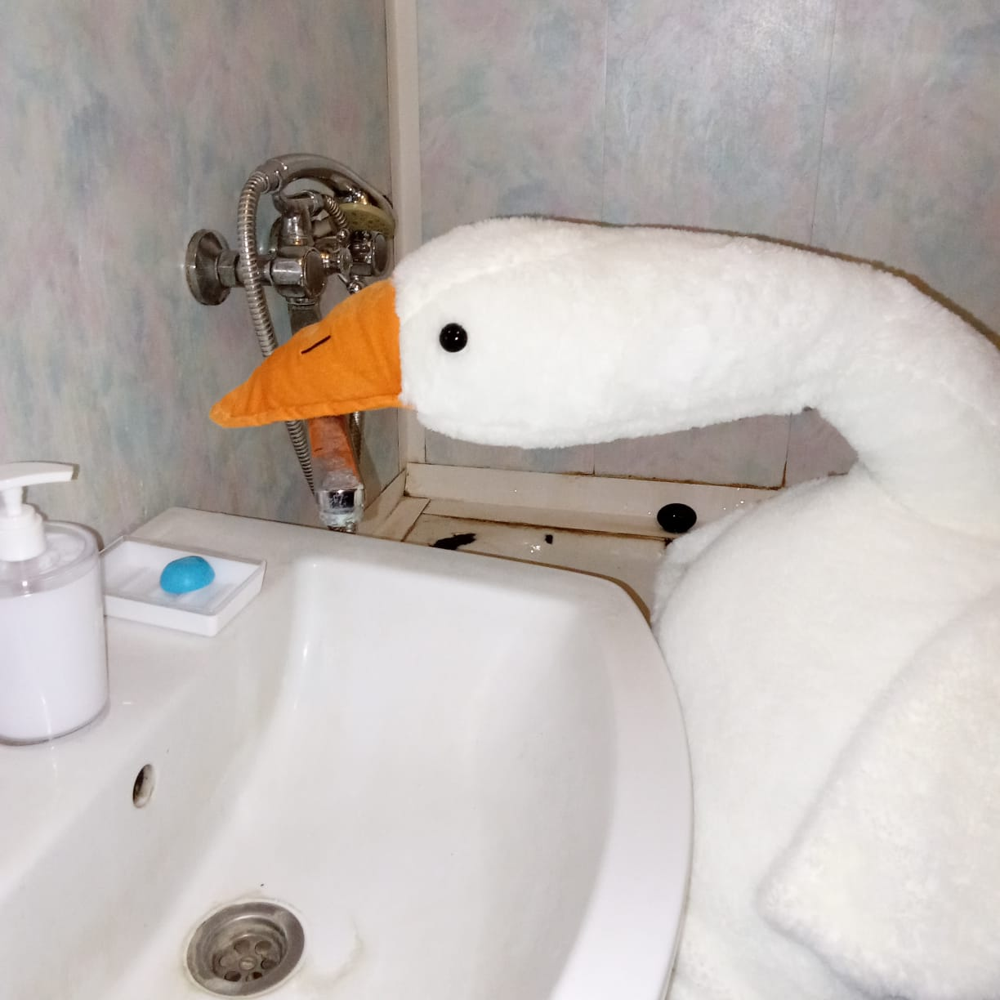
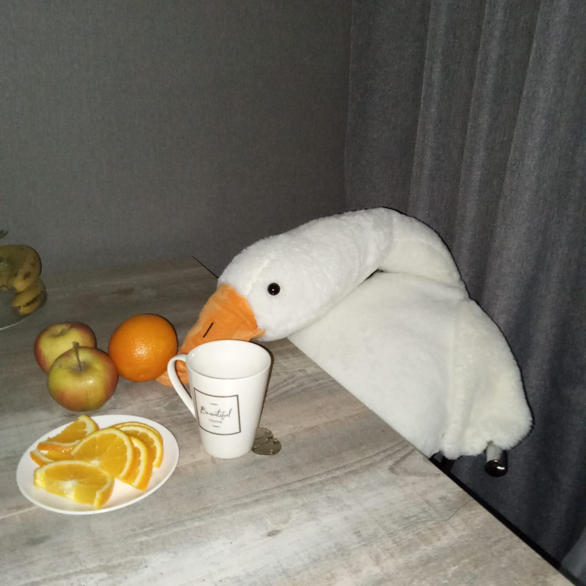
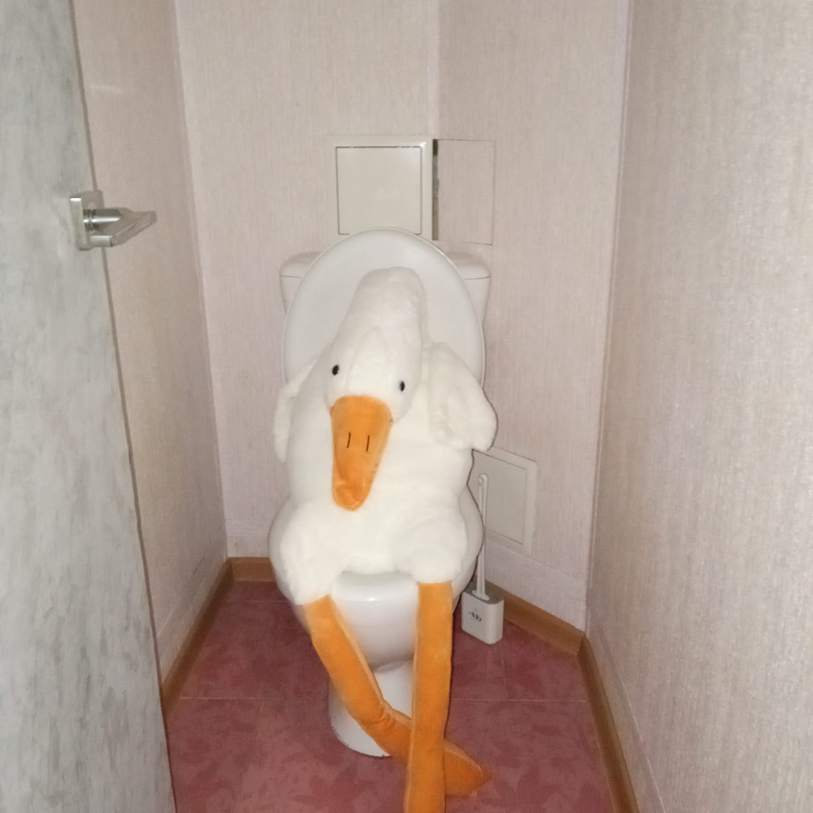
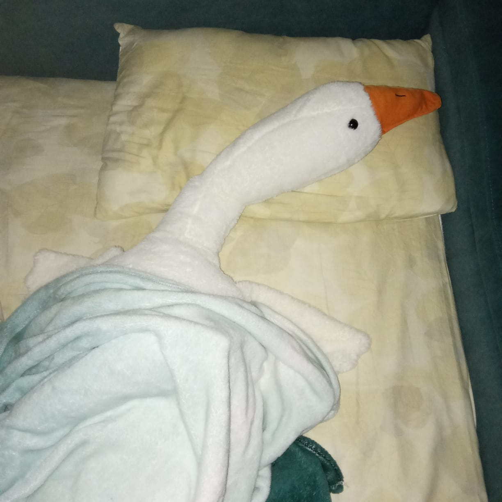

<html lang="ru">
<head>
    <meta charset="UTF-8">
    <meta name="viewport" content="width=device-width, initial-scale=1.0">
    <title>Гуси: Факты и Шутки</title>
    
</head>
<body>

    <h1>Гуси: Факты и Шутки</h1>
    
Гуси - это водоплавающие птицы, которые известны своим характерным гусем и громким гоготом. Давайте узнаем о них больше и посмеемся вместе!

    

        

            
        

        

            
        

    

    <h2>Интересные факты о гусях</h2>
    
1. Гуси могут путешествовать на большие расстояния, мигрируя в поисках пищи и более теплого климата.

    
2. Они очень социальные птицы и предпочитают жить в группах.

    
3. Гуси являются отличными защитниками и могут быть очень агрессивными, если чувствуют угрозу.

    
4. Гуси имеют отличное зрение и могут видеть в цвете.

    <h2>Шутки о гусях</h2>
    
Почему гуси никогда не теряются? Потому что у них всегда есть "гусеничка"! 🦢

    
Что сказал один гусь другому, когда они встретились? "Гусь, рад тебя видеть!"

    
Почему гуси такие хорошие певцы? Потому что у них есть "гусли"! 🎶

    <h2>Мемы о гусях</h2>
    

        

            
        

        

            
        

    

    <footer>
        
Сделано Дарьей для своей сестры Варвары 05.03.25

    </footer>

</body>
</html>
